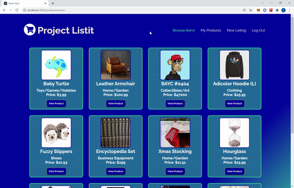
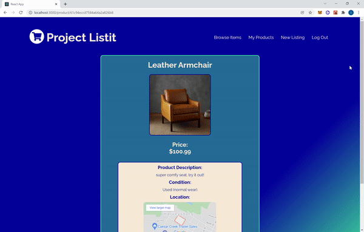

<h2>Description:</h2>

Project Listit is a skinny version of Facebook Marketplace / Craigslist where users can buy and sell goods. Full-stack CRUD application built with MongoDB, Express, React, Node.js, and Google Maps Embed API.
 

<h2>Features:</h2>
<ul>
  <li>User login and registration</li>
  <li>Frontend & backend validations</li>
  <li>Responsive web design with custom navbar</li>
  <li>Home page displays all items listed for sale</li>
  <li>Contact seller button on product page with mailto link</li>
  <li>Edit/delete product buttons appear if creator is currently signed in</li>
  <li>Product listings utilize Google Maps Embed API to display relative location</li>
</ul>

<h2>Demo:</h2>

Home Page - Browse Items for Sale

Product Details

